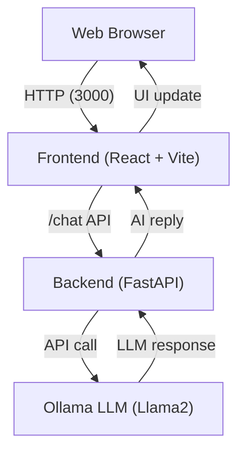

# 🧠 AI Chat App

A modern, full-stack conversational AI chat application powered by FastAPI, React, and Ollama (Llama2). Run locally with Docker Compose or develop each service independently. Enjoy a beautiful, responsive chat UI and robust backend API for building your own AI-powered experiences.

---

## 🚀 Features

- **Conversational AI**: Chat with an LLM (Llama2 via Ollama) in real time
- **Modern UI**: Sleek, responsive React + Vite frontend
- **FastAPI Backend**: Simple, async Python API for chat and conversation history
- **Containerized**: One-command startup with Docker Compose
- **Customizable**: Easily swap models or extend the UI/API
- **CORS & Proxy**: Ready for local development and production

---

## 🏗️ Architecture



---

## 📁 Folder Structure

```
ai-chat-app/
├── backend/         # FastAPI backend (Python)
│   ├── main.py
│   ├── requirements-backend.txt
│   └── Dockerfile.backend
├── frontend/        # React + Vite frontend (TypeScript)
│   ├── src/
│   ├── public/
│   ├── Dockerfile
│   ├── nginx.conf
│   └── ...
├── ollama/          # Ollama LLM service (Llama2)
│   ├── Dockerfile.ollama
│   └── entrypoint.sh
├── docker-compose.yml
├── conversation.http
├── hello.http
└── README.md
```

---

## 🛠️ Tech Stack

- **Frontend**: React 19, TypeScript, Vite, Axios, modern CSS
- **Backend**: FastAPI, Python 3.11, httpx, Pydantic, Uvicorn
- **LLM**: Ollama (Llama2)
- **Containerization**: Docker, Docker Compose, Nginx (frontend)

---

## ⚡ Quickstart

### 1. Prerequisites

- [Docker](https://www.docker.com/get-started) & [Docker Compose](https://docs.docker.com/compose/)

### 2. Start All Services

```bash
git clone https://github.com/yourusername/ai-chat-app.git
cd ai-chat-app
docker-compose up --build
```

- Frontend: http://localhost:3000
- Backend API: http://localhost:8000
- Ollama LLM: http://localhost:11434

### 3. Develop Locally (Optional)

- **Backend**
  ```bash
  cd backend
  pip install -r requirements-backend.txt
  uvicorn main:app --reload --host 0.0.0.0 --port 8000
  ```
- **Frontend**
  ```bash
  cd frontend
  npm install
  npm run dev
  ```
  (Vite dev server proxies /chat to backend)

---

## 🧑‍💻 Usage Examples

### API (cURL)

```bash
curl -X POST http://localhost:8000/chat \
  -H 'Content-Type: application/json' \
  -d '{"message": "Hello, who are you?", "conversation_id": "default"}'
```

### Multi-turn Conversation

```http
POST http://localhost:8000/chat
Content-Type: application/json

{
  "message": "Hello, my name is Patricio",
  "conversation_id": "1"
}

POST http://localhost:8000/chat
Content-Type: application/json

{
  "message": "I'm doing fine, what's my name?",
  "conversation_id": "1"
}
```

### Frontend UI

- Open [http://localhost:3000](http://localhost:3000)
- Type a message and chat with the AI!

---

## 🤝 Contributing

Pull requests welcome! For major changes, please open an issue first to discuss what you would like to change.

---

## 📄 License

[MIT](LICENSE)
